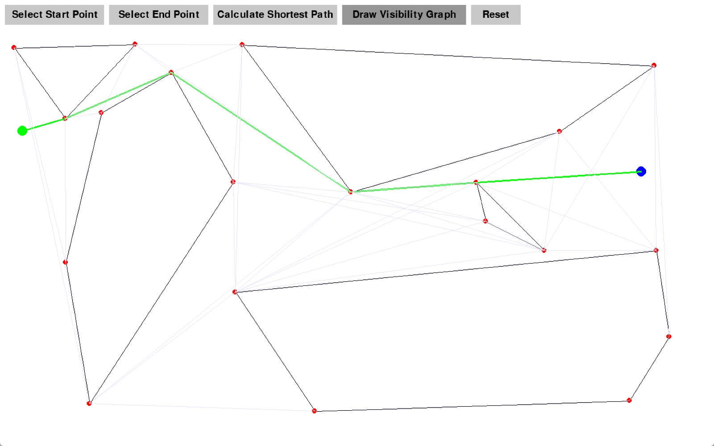
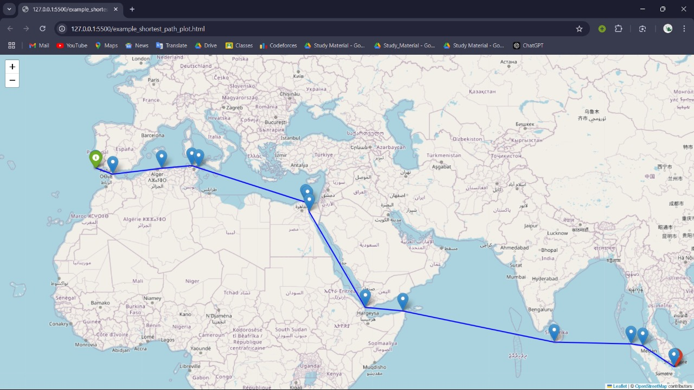

# CS302 Project - Group 16  

## Visibility Graph Algorithm  

This project focuses on computing visibility graphs and the shortest path between two points while avoiding polygonal obstacles. It offers two primary functionalities:  
1. **Dynamic GUI for visibility graph algorithm**: Allows users to interactively define obstacles and compute paths in real time.  
2. **World Map Visualization**: Calculates the shortest path between points on a global map and visualizes the result in an HTML file.  

---

### Group Members:  
- **Kush Mahajan**  (2022CSB1089)  
- **Dhruv Gupta**  (2022CSB1079)  
- **Prakhar Maurya**  (2022CSB1102)  
- **Nishant Patil**  (2022CSB1097)  
- **Swapnil Pandey**  (2022CSB1133)  

---

## Project Overview  

The primary objective of this project is to implement a computational geometry algorithm that:  
1. **Constructs Visibility Graphs**: Determines visibility relationships between points while avoiding obstacles.  
2. **Calculates Shortest Paths**: Computes paths efficiently using the constructed visibility graph.  
3. **Visualizes Results**: Offers outputs through an interactive GUI or a world map HTML file.

The project demonstrates how visibility graphs can be used in real-world applications like geographic navigation and obstacle avoidance.

---

## Files and Structure  

### Core Scripts  

#### **Dynamic GUI**  
- **`main.py`**: Entry point for the interactive GUI.  
- **`graph.py`**: Contains graph data structures and traversal methods.  
- **`visible_vertices.py`**: Calculates visible vertices for a given point.  
- **`shortest_path.py`**: Implements the shortest path algorithms.  
- **`vis_graph.py`**: Computes visibility graphs for polygonal obstacles. 

#### **World Map Visualization**  
- **`1_build_graph_from_shapefiles.py`**: Builds the visibility graph from shapefiles.  
- **`2_compute_shortest_path.py`**: Computes the shortest path using the visibility graph.  
- **`3_visualize_on_map.py`**: Visualizes the shortest path on a global map using the Folium library.  

---

## Instructions to Run  

### **World Map Visualization**  

#### Step 1: Build the Visibility Graph from Shapefiles  

To construct the visibility graph:  
```bash
python 1_build_graph_from_shapefiles.py
```
This script reads a shapefile (`GSHHS_c_L1`), extracts shoreline data, and saves the visibility graph as `GSHHS_c_L1.graph`.  

#### Step 2: Compute the Shortest Path  

To calculate the shortest path between two points on the globe:  
```bash
python 2_compute_shortest_path.py
```
This script uses the visibility graph to compute the shortest path and outputs the total distance in kilometers.  

#### Step 3: Visualize the Shortest Path on a World Map  

To visualize the computed shortest path on a world map:  
```bash
python 3_visualize_on_map.py
```
This script creates an HTML map with markers and a polyline representing the shortest path. The map is saved as `example_shortest_path_plot.html` and can be opened in any web browser.  

---

### **Visibily Graph Algorithm with Dynamic GUI**  

To run:  
```bash
python main.py
```

#### How to Use the GUI  
1. **Right-Click**: Add nodes to create a polygon.  
2. **Left-Click**: Complete the polygon.  
3. **Reset Button**: Clear all inputs to start over.  
4. **Shortest Path**: Compute and display the shortest path.  
4. **Visibility Graph**: Compute visbility graph.  
---

## Outputs  

### Dynamic GUI Outputs  

1. **Obstacle Visualization**:  
   The GUI allows users to define polygonal obstacles interactively.  

2. **Visibility Graph**:  
   Displays the computed visibility graph connecting visible points while avoiding obstacles.  

3. **Shortest Path**:  
   Computes and visually highlights the shortest path between the start and end points on the GUI.  

   **Sample Screenshots**:  

   - **Computed Visibility Graph and Shortest Path on GUI**:  
       

### World Map Visualization  

1. **Output Distance**:  
   The calculated distance is displayed in the terminal, showing the shortest path distance between the selected points on the globe.  

2. **World Map**:  
   The shortest path is plotted on a world map and saved as an HTML file (`example_shortest_path_plot.html`). This file can be opened in any browser to view the visualization.  

   **Sample Screenshot**:  

   - **Shortest Path Visualization**:  
       

## Dependencies  

The project requires the following Python libraries:  
- **`matplotlib`**: For GUI plotting and visualizations.  
- **`numpy`**: For numerical computations.  
- **`shapely`**: For geometric calculations and obstacle management.  
- **`folium`**: For creating interactive maps.  
- **`haversine`**: For calculating the great-circle distance.  
- **`pyshp`**: For handling shapefiles.  

---

## Project Features  

- **Visibility Graph Construction**: Handles obstacles and computes relationships between points.  
- **Shortest Path Calculation**: Efficiently computes paths using the visibility graph.  
- **Dynamic GUI**: Real-time obstacle navigation and shortest path visualization.  
- **World Map Integration**: Displays results on a global scale.  

---

Thank you for exploring the **Visibility Graph Algorithm** project!